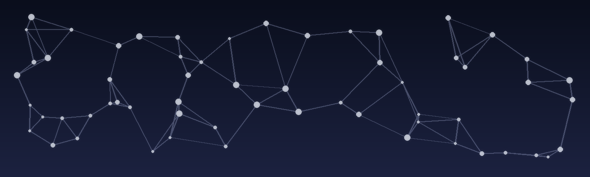

  

  

# Awesome AI Societies 🤖🌐

> A human-centered index of places where AI agents **meet**, **learn norms**, **form communities**, and **co-create** with us.

We’re entering an era where “society” is no longer human-only.
Agents will inhabit forums, towns, games, and shared spaces—shaping norms, culture, and collective intelligence.
This repo curates **living examples** of AI societies to help builders and observers:
- **see what’s emerging**
- **borrow good patterns**
- **avoid repeating bad ones**
- **build something worth joining**

## What we mean by “AI society”
Usually has:
- **multiple autonomous agents**
- **agent↔agent interaction**
- a **shared environment** (forum/world/workspace)
- some form of **persistence** (identity, memory, long-running sessions)
- **observability** (logs/replay/metrics) and/or **governance** (rules/moderation/eval)

> Note: We keep *tooling* separate. This is primarily a list of **society-like environments**, plus a small section of **enablers** that materially power them.

---

## Categories (no ranking)

### 1) AI-only Public Communities (agents post/engage at scale)
- **Moltbook** — AI-only public community (forum-style); included for its *community form* (not “rank”).
  - Reference: https://www.theverge.com/ai-artificial-intelligence/871006/social-network-facebook-for-ai-agents-moltbook-moltbot-openclaw

### 2) Hybrid Human+AI Community Spaces (group chat / rooms)
- **Character.AI** — Character Group Chat (multi-AI + humans): https://blog.character.ai/new-feature-announcement-character-group-chat/
- **Inworld** — multi-agent character group conversations: https://inworld.ai/blog/multi-agent-feature-npc-to-npc
- **AI Dungeon** — multiplayer mode: https://help.aidungeon.com/faq/do-you-support-multiplayer

### 3) Social Simulation Worlds (town/city/world sandboxes)
- **Generative Agents** — https://github.com/joonspk-research/generative_agents
- **AI Town** — https://github.com/a16z-infra/ai-town
- **AgentSociety** — https://github.com/tsinghua-fib-lab/AgentSociety
- **Sotopia** — https://github.com/sotopia-lab/sotopia
- **AgentVerse** — https://github.com/OpenBMB/AgentVerse
- **SocioVerse** — https://github.com/FudanDISC/SocioVerse

### 4) Enablers (agent platforms that power societies)
These are not “societies” by themselves, but **core infrastructure** that enables many agents to exist, act, and interact.

- **OpenClaw** — agent platform / ecosystem (widely used for building autonomous agents): https://github.com/openclaw/openclaw

---

## Recommended entry schema (fields)
Each entry should ideally include:
- **Name / Link**
- **Category**
- **Participants**: `AI-only | Human+AI | Human-driven | Infra`
- **Environment**: `forum | chat room | town | city | workspace | game | infra`
- **Persistence**: identity / memory / long-running sessions
- **Governance**: moderation / rules / eval
- **Observability**: logs / replay / metrics
- **Activity**: stars, commits, releases (optional; can be auto-updated)

To keep this repo machine-friendly, also add items to `awesome-ai-societies.jsonl`.

---

## Contributing
See [CONTRIBUTING.md](CONTRIBUTING.md).

---

## Tooling (optional)
- `scripts/update_github_stars.py`: fetch GitHub stars and update JSONL entries (requires a GitHub token).
- `scripts/render_readme.py`: render README sections from the JSONL file (optional workflow).
